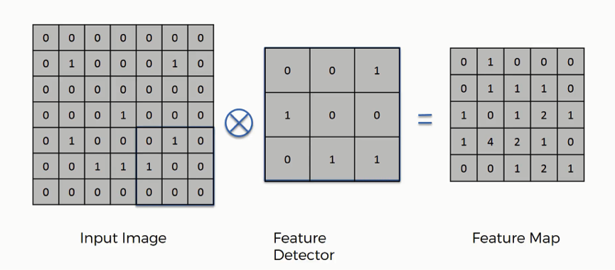
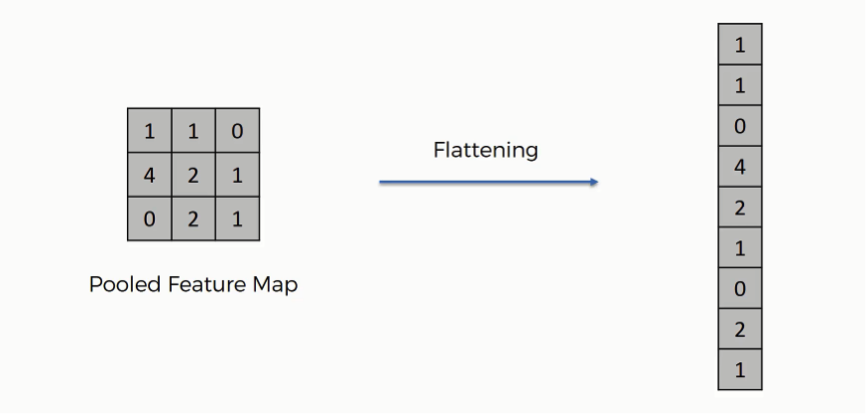

# Convolutional Neural Network - Cifar10 Dataset

**An implementation of a CNN for the Cifar-10 Dataset**

---

**Theoretical Topics:** *Neural network, Convolutional Neural Network, Normalization*

**Tools / Technologies:** *Python, Tensorflow*

---

### Technical Explanation:

Convolutional Neural Network -- [CNN.py](https://github.com/harshp30/ViolaJonesVideoAnonymizer/blob/main/CNN.py)

*What is a CNN?*

> A convolutional neural network is a class of artificial neural network most commonly applied to analyze visual imagery

CNNs have one major assumption, the inputs have to be images that's what CNNs are deisgned for
We can encode the certain properties within the architechure:
- Neurons are not connected to every enuron in the next layer
- Under the hood it uses a standard neural network architecture but the data is tranformed to improve accuracy

There are 3 key important steps:
1. Convolutional Operation (kernel)

    Kernels can be used to detect relevant features in a given image

    There are multiple kernels that can perform various features:
    - Sharpen Kernel
    - Edge Detcetion Kernel
    - Blur Kernel

    

    Every single kernel will use a specific feature of the image

    How would you decide which features detector to use?
    - CNN use many kernels and during the training procedure it seletcs the best possible kernel to use

    Several features maps are created because of many feature detectors applied on the same image, then the ReLU activation function is applied to introduce non-linearity

2. Pooling

    We would like to detect the same object no matter where it is located on the image no matter it's rotation or any other transformation (spatial invariance)

    With max pooling we select the most relevant features, this is how we deal with spatial inavirance

    We reduce the dimensions of the image in order to end with a dataset containing the important pixel values without unnecessary noise

    

3. Flattening

    In flattening we transform the matrix into 1D, we preprocess the data like this and use ANN with just the releveant features

    We use multilayer neural network and learn the non-linear combinations of these important features

    We then use gradient descent (backpropagation) to train the CNN, this envolves update the edge weights according to the error and choosing thr right filter (kernel filter)

    

We appply a matrix operation to multiply the values:

`f(x,y)*g(x,y) = Σ[cols,n=0]Σ[rows,m=0]g(n,m)*f(x-n,y-m)`

*Explanation*

Using a CNN I trained it on the following Cifar-10 dataset

*What is a Cifar-10?*

> The Cifar-10 Dataset is a publicly avaliable dataset containing images between 10 different classes

"The CIFAR-10 dataset consists of 60000 32x32 colour images in 10 classes, with 6000 images per class. There are 50000 training images and 10000 test images.

The dataset is divided into five training batches and one test batch, each with 10000 images. The test batch contains exactly 1000 randomly-selected images from each class. The training batches contain the remaining images in random order, but some training batches may contain more images from one class than another. Between them, the training batches contain exactly 5000 images from each class."

Here are the classes in the dataset, as well as 10 random images from each: 

*Results*

The following is the result of the network after 100 EPOCHS:

`Epoch 100/100` 

`782/782 - 160s - loss: 0.0961 - accuracy: 0.9667 - val_loss: 0.6746 - val_accuracy: 0.8476`

`Accuracy of CNN model: 84.7599983215332`
    
---

### Next Steps:

- Try integrating CUDA to speed up training by utilizing a GPU
- Increase number of epochs

---

### Additional Notes:

- The Cifar-10 dataset credit: https://www.cs.toronto.edu/~kriz/cifar.html
